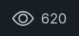
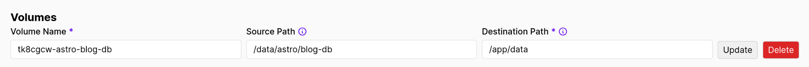

As my blog slowly accumulates posts, I started wondering how many views each one was getting. Although I have analytics set up for this site, there's no convenient way to use that information to do something like add a section of the most popular posts to the landing page. I decided that a bare-bones implementation of a view counter would help me accomplish two things: 
1. Automatically display popular posts in a component on the landing page or wherever else.
2. Add a bit of old-internet charm to my posts by displaying the view count.

I found several tutorials that implement a view counter in a few different ways, including [using Server Islands and Astro db](https://www.thomasledoux.be/blog/using-server-islands-actions-view-counter), [a normal Astro component and an external service](https://elazizi.com/posts/add-views-counter-to-your-astro-blog-posts/), and [a Svelte component with Astro db](https://dev.to/vorillaz/how-to-build-a-views-counter-with-astro-db-3ip6).

I started out trying to build it with Astro db, but quit once I realized that there is no documented way to deploy the DB locally in production. I strive for simplicity whenever possible, so the prospect of setting up a remote LibSQL service like Turso only for a dinky view counter was very unappealing. There had to be another way! 

## Requirements
1. Completely local deployment. No remote databases or connections. No third-party services.
2. Minimal dependencies. Add as little as possible to the project.
3. No page-load overhead. The page speed shouldn't be affected by the component.

## Solution
1. SQLite was an obvious choice. Small, local, and fast. Since my blog isn't serving thousands of views per second, there is minimal concern about concurrency and scalability. Concurrency in SQLite has been overstated as an issue for a long time, considering [WAL mode was introduced in 2010](https://www.sqlite.org/wal.html). It's safe to say it won't be an issue in my use case, which doesn't require extremely robust durability anyway.
2. Again, SQLite wins here. We can get it up and running with just a few packages and 0 vendor lock-in by using better-sqlite3 and drizzle-orm (if you want an ORM). 
3. To accomplish this, we're going to take advantage of Astro's relatively new [Server Islands](https://docs.astro.build/en/guides/server-islands/), which will let us serve our prerendered content in full and then swap in the dynamic view counter when its ready on the server. This has a few advantages in my eyes: 
   - Since we're not using a framework component, we don't have to install an entire JS framework as a dependency. 
   - Since all reads and writes to the database are handled on the server, which then passes rendered HTML to the client, the database operation always happens in a consistent environment and we maintain a strong separation between client and server.
   - The page finishes loading before the view counter renders, so even if the user has a slow internet connection, the view counter doesn't affect their page load time.

So let's get to it.

## Steps

### 1. Set up the DB
We're going to install better-sqlite3 and drizzle-orm, although you're more than welcome to do this without an ORM, and it might be overkill for a single table. 
```
npm install drizzle-orm better-sqlite3
```
Then we're going to create a folder called `lib` at `src/lib/`, and two files, `lib/schema.ts` and `lib/db.ts`.

Inside `schema', we'll define our database table: 

```
import { sqliteTable, text, integer } from 'drizzle-orm/sqlite-core';

export const Views = sqliteTable('Views', {
  slug: text('slug').primaryKey(),
  count: integer('count').default(1),
});
```
Here we're using drizzle to define a table called `Views` that uses the slug as a primary key and an integer for count. That's it!

Then, in `db`, we'll set up the client: 
```
import Database from 'better-sqlite3';
import { drizzle } from 'drizzle-orm/better-sqlite3';
import { mkdir } from 'fs/promises';
import { existsSync } from 'fs';
import { dirname } from 'path';
import { Views } from './schema';

const DB_PATH = './data/astro.db';

async function ensureDirectoryExists() {
  const dir = dirname(DB_PATH);
  if (!existsSync(dir)) {
    await mkdir(dir, { recursive: true });
  }
}

async function setupDatabase() {
  await ensureDirectoryExists();
  
  const sqlite = new Database(DB_PATH);
  const db = drizzle(sqlite);
  
  // Check if Views table exists
  const tableExists = sqlite.prepare(
    "SELECT name FROM sqlite_master WHERE type='table' AND name='Views'"
  ).get();
  
  if (!tableExists) {
    console.log('Creating Views table...');
    sqlite.exec(`
      CREATE TABLE IF NOT EXISTS Views (
        slug TEXT PRIMARY KEY,
        count INTEGER DEFAULT 1
      )
    `);
  }
  
  return db;
}

export const dbClient = await setupDatabase();

```
Here, we're doing a few things.
1. Create the directory if it doesn't exist.
2. Connect to the database.
3. Check if the `Views` table exists, and if not, create it.
4. Export the `dbClient` for use elsewhere.
   
<p class="font-medium border border-b-4 border-r-4 rounded-lg p-4 mb-0 inline-block"><span><svg xmlns="http://www.w3.org/2000/svg" class="mb-2 text-red-500" width="24" height="24" fill="currentColor" class="bi bi-exclamation-triangle" viewBox="0 0 16 16">
  <path d="M7.938 2.016A.13.13 0 0 1 8.002 2a.13.13 0 0 1 .063.016.15.15 0 0 1 .054.057l6.857 11.667c.036.06.035.124.002.183a.2.2 0 0 1-.054.06.1.1 0 0 1-.066.017H1.146a.1.1 0 0 1-.066-.017.2.2 0 0 1-.054-.06.18.18 0 0 1 .002-.183L7.884 2.073a.15.15 0 0 1 .054-.057m1.044-.45a1.13 1.13 0 0 0-1.96 0L.165 13.233c-.457.778.091 1.767.98 1.767h13.713c.889 0 1.438-.99.98-1.767z"/>
  <path d="M7.002 12a1 1 0 1 1 2 0 1 1 0 0 1-2 0M7.1 5.995a.905.905 0 1 1 1.8 0l-.35 3.507a.552.552 0 0 1-1.1 0z"/>
</svg></span> <span class="font-bold text-red-500">Warning!</span> If you plan to expand your DB schema later, you're much better off using Drizzle migrations. However, since this is only one table with two columns, I've opted to directly create the table in db.ts and define its types separately. This means that if I want to make any changes, I will need to make sure that both match, increasing the chances of a mistake. It's up to you. I decided that the upfront complexity of setting up migrations wasn't worth it for my use case.</p>

### 2. Implement the view counter

To use Server Islands, we're going to need to install an adapter. I am using the [node on-demand rendering adapter](https://docs.astro.build/en/guides/integrations-guide/node/) and keeping all of my content static by using the following setting in my `astro.config.mjs`:
```
  output: 'static',
  adapter: node({
    mode: 'standalone',
  }),
```
Just like before, all of my content will be prerendered by default, but we can make use of some additional server features. 

Let's take a look at our full `ViewCounter.astro` and then break it down piece-by-piece.

```
---
import { Icon } from 'astro-icon/components';
import { dbClient } from '../lib/db';
import { Views } from '../lib/schema';
import { sql } from 'drizzle-orm';

const { slug } = Astro.props;
let item;

try {
  // Upsert: insert a new row (with count 1) or, if it exists, increment the count.
  item = await dbClient
    .insert(Views)
    .values({ slug, count: 1 })
    .onConflictDoUpdate({
      target: Views.slug,
      set: { count: sql`count + 1` },
    })
    .returning({
      slug: Views.slug,
      count: Views.count,
    })
    .then((res) => res[0]);
} catch (error) {
  console.error(error);
  item = { slug, count: 1 };
}
---

<div class="inline-flex gap-2 items-center">
  <div class="tooltip tooltip-primary tooltip-bottom" data-tip="View count">
    <Icon name="bi:eye" size={25} />
  </div>
  <span>{item.count}</span>
</div>

<style>
  .tooltip-primary {
    --tooltip-text-color: white;
  }
</style>
```

Here's a breakdown of what's happening: 
1. We're getting all of our imports and then setting `slug` as a prop to pass into the component. If you remember, we're using the slug as the primary key for our Views table, so we'll use it to get the associated view count from our DB. 
2. We're doing the database operation: 
```
try {
  // Upsert: insert a new row (with count 1) or, if it exists, increment the count.
  item = await dbClient
    .insert(Views)
    .values({ slug, count: 1 })
    .onConflictDoUpdate({
      target: Views.slug,
      set: { count: sql`count + 1` },
    })
    .returning({
      slug: Views.slug,
      count: Views.count,
    })
    .then((res) => res[0]);
} catch (error) {
  console.error(error);
  item = { slug, count: 1 };
}
```
   - First we insert a view count of 1 at the slug as a new row, but if that row already exists, then we take the existing count and increment it by 1.
   - Then we return the slug and the count.
   - Then we return the first element of the `res` array just for convenience's sake.
   - Finally, we try to catch any potential errors and make sure that the item always has a view count of at least one.
3. Finally, we display the count next to an eye icon and use a [Daisy UI tooltip](https://daisyui.com/components/tooltip/), although how you display the views is a matter of taste.

The final result looks like this, the same counter you saw at the top of this article: 



(*Yes, I specifically chose the article with the most views for this screenshot.*)

### 3. Add it as a Server Island to our blog post layout.
Wherever you're templating your blog post data, you can now use the component: 
```
<ViewCounter server:defer slug={slug}>
    <ViewCounterLoading slot="fallback"></ViewCounterLoading>
</ViewCounter>
```
The key elements here are the `server:defer` directive, the `slug` prop, and our fallback component, `ViewCounterLoading`. `server:defer` marks it as a Server Island and lets us slot in a [fallback component](https://docs.astro.build/en/guides/server-islands/#server-island-fallback-content), which will display until the HTML for our island is ready to display and sent to the client. 

Our fallback component just looks exactly like our rendered component, but with three dots to represent loading and a default animation from Tailwind CSS. Here is that component in brief: 
```
---
import { Icon } from 'astro-icon/components';
---

<div class="inline-flex gap-2 items-center">
  <div class="tooltip tooltip-primary tooltip-bottom" data-tip="View count">
    <Icon name="bi:eye" size={25} />
  </div>
  <span class="animate-pulse text-xl">...</span>
</div>

<style>
  .tooltip-primary {
    --tooltip-text-color: white;
  }
</style>
```

### 4. Deploy
Now you're ready to deploy. If you're deploying using Docker, you'll need to create a volume and the persistent directory on your server. Since I'm using [Coolify to host my site](/blog/astro-ssr-with-coolify), I'll create a new Docker volume in the interface. The result is this: 



Make sure the source directory exists on your host machine, and you should be good to go. 

***Deploy and enjoy.***

## Conclusion
I hope this was helpful! If you have questions, comments, or corrections, feel free to leave a comment at the bottom of this page. You can see more of my tutorials in the related posts box below. Happy building!