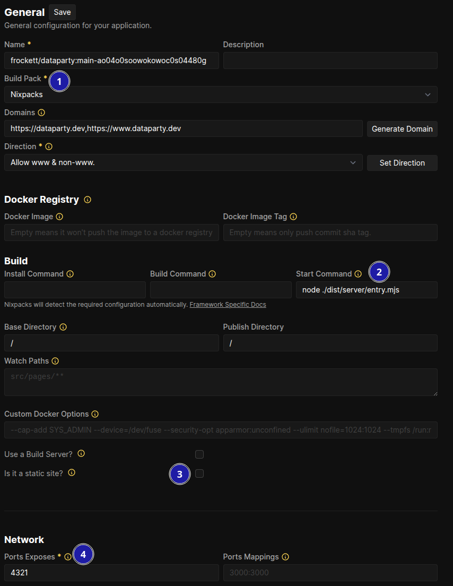

<svg xmlns="http://www.w3.org/2000/svg" class="mb-2" width="24" height="24" fill="currentColor" class="bi bi-exclamation-triangle" viewBox="0 0 16 16">
  <path d="M7.938 2.016A.13.13 0 0 1 8.002 2a.13.13 0 0 1 .063.016.15.15 0 0 1 .054.057l6.857 11.667c.036.06.035.124.002.183a.2.2 0 0 1-.054.06.1.1 0 0 1-.066.017H1.146a.1.1 0 0 1-.066-.017.2.2 0 0 1-.054-.06.18.18 0 0 1 .002-.183L7.884 2.073a.15.15 0 0 1 .054-.057m1.044-.45a1.13 1.13 0 0 0-1.96 0L.165 13.233c-.457.778.091 1.767.98 1.767h13.713c.889 0 1.438-.99.98-1.767z"/>
  <path d="M7.002 12a1 1 0 1 1 2 0 1 1 0 0 1-2 0M7.1 5.995a.905.905 0 1 1 1.8 0l-.35 3.507a.552.552 0 0 1-1.1 0z"/>
</svg> This is a very short addendum to an earlier tutorial on <a href="/blog/astro-with-coolify">deploying a static Astro site with Coolify</a>. This tutorial only covers the differences in configuration required to deploy an SSR site. If this is your first time deploying an Astro site using Coolify, I suggest you read the previous tutorial first, and then come back to this one.

## Deploying your SSR Astro site to a VPS
This tutorial assumes that you have some familiarity with deploying a static site to your VPS using Coolify. If not, please check out my [previous article](/blog/astro-with-coolify) on setting up Coolify to deploy your static Astro site.

It also assumes that you have already set up your Astro project to use the Node adapter. If not, there is excellent documentation on the [Astro website](https://docs.astro.build/en/guides/integrations-guide/node/).

### Motivations
Although it's a minor inconvenience, there are two quirks about deploying an Astro site that uses an SSR adapter using Coolify. These quirks are not obvious and require a good bit of troubleshooting to solve. They mostly happen because the auto-generated Nixpacks config for building your Astro SSR project isn't 100% accurate. In light of that, it's possible that this tutorial will become unnecessary in the future. 

If you trawl through the Coolify Discord server, you can find a couple discussions where the issues are resolved, but I hope here to make an easy-to-follow guide readily available online. Figuring out this issue was a real pain, so I hope this makes it a bit easier for others. It all comes down to two input fields in the Coolify config dashboard.

### Prerequisites
1. An Astro project with the Node adapter installed.
2. A Coolify project setup with public or private repo linked.

### Configuration

1. We're using Nixpacks to build the site, same as the static deployment.
2. **This is the quirk that trips most people up**, and the solution to which I had to find on the Discord server. You need to correctly point the `Start Command` to `node ./dist/server/entry.mjs` (or wherever your entrypoint is, but it should be there unless you changed it.)
3. Make sure `Is it a static site?` is unchecked.
4. **This is the second quirk**. You need to specify the exposed port. Astro exposes port `4321` by default in both dev and prod. In my experience, if you leave this field blank then it will not work.

**Make sure you hit save. Coolify does not autosave configuration changes.**

### Conclusion
That's it! Your site should now build and be exposed at the configured domain. Very simple. I hope I saved you a couple hours chasing down Reddit threads and searching old Discord conversations.