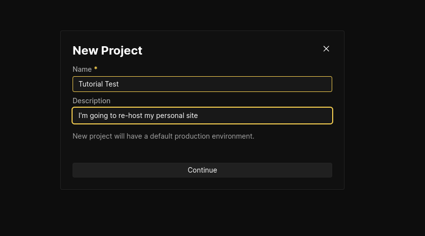
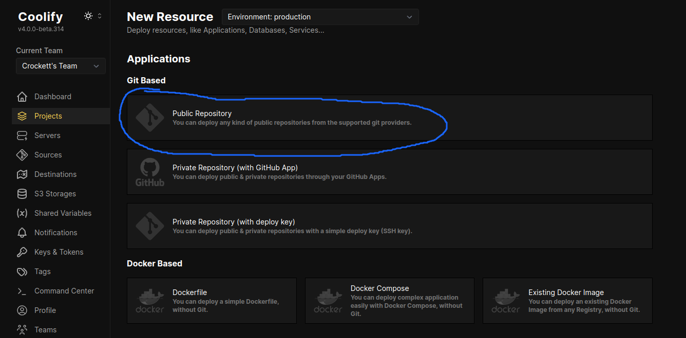
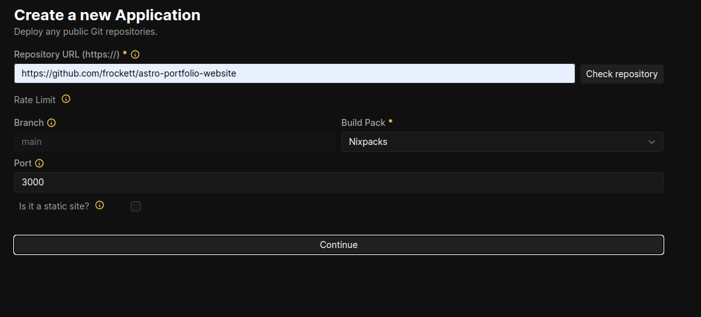
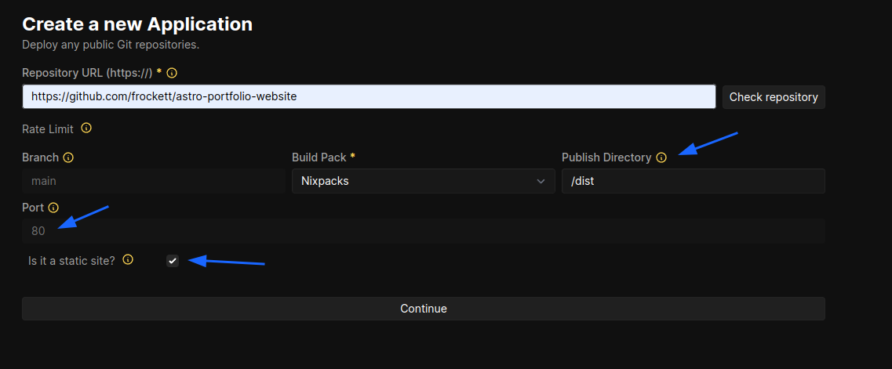
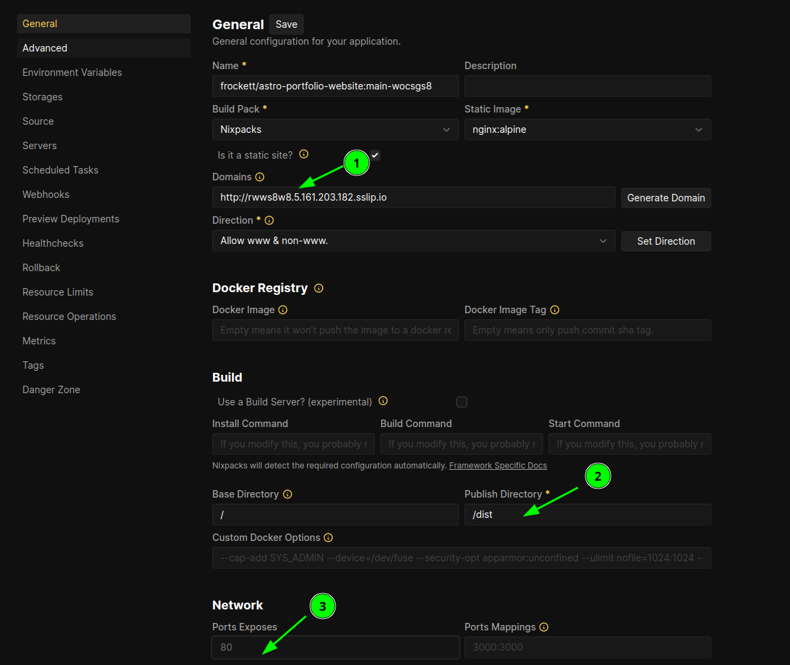

<svg xmlns="http://www.w3.org/2000/svg" class="mb-2" width="24" height="24" fill="currentColor" class="bi bi-exclamation-triangle" viewBox="0 0 16 16">
  <path d="M7.938 2.016A.13.13 0 0 1 8.002 2a.13.13 0 0 1 .063.016.15.15 0 0 1 .054.057l6.857 11.667c.036.06.035.124.002.183a.2.2 0 0 1-.054.06.1.1 0 0 1-.066.017H1.146a.1.1 0 0 1-.066-.017.2.2 0 0 1-.054-.06.18.18 0 0 1 .002-.183L7.884 2.073a.15.15 0 0 1 .054-.057m1.044-.45a1.13 1.13 0 0 0-1.96 0L.165 13.233c-.457.778.091 1.767.98 1.767h13.713c.889 0 1.438-.99.98-1.767z"/>
  <path d="M7.002 12a1 1 0 1 1 2 0 1 1 0 0 1-2 0M7.1 5.995a.905.905 0 1 1 1.8 0l-.35 3.507a.552.552 0 0 1-1.1 0z"/>
</svg> This tutorial covers deploying a static Astro site.
If you're looking for a guide on deploying an Astro site that uses SSR and the Node adapter, complete step 1 of this guide and then check out my newer post on <a href="/blog/astro-ssr-with-coolify">deploying an Astro SSR site using Coolify</a>

## Self-hosting your website
I've already written about my [enthusiasm for self-hosting](/blog/i-love-coolify/) and especially for Coolify as a tool. The deployment process for an Astro site is incredibly straightforward, but I thought I'd write this quick tutorial for anyone less than confident in their configuration skills. 

Trying things for yourself and not being afraid to break something is a good mindset, but, once you do break something, sometimes you need help putting it back together. 

This guide assumes you already have an instance of Coolify up and running and a server for it to manage with something in the ballpark of 1GB of ram minimum. I will also assume that you have your domain set up and DNS records pointing to the domain of the server you will use.

Let's get to it.

### Step 1: Create Your Project and Resource

In the Coolify projects menu, create a new project and name it something memorable.

The project will open automatically. Enter the default production environment and click the button to add a resource. I'll be adding from a public repository (the one for this website), but private GitHub repositories work and support push to deploy out of the gate with a GitHub app.

Next, you will be prompted to select which Coolify-managed server you want to deploy to. After that, you will enter the URL for the Git repo that you want to deploy from.

Here is the first important choice, which brings us to the next step.

### Step 2: Configure your build

Once you've entered your repo's URL and checked the repository, some additional input fields will appear. One is to select but build pack. In our case we're going to use Nixpacks, since we haven't prepared a Dockerfile and Astro takes care of most of the build while the rest of what we need is clearly spelled out in our package.json. Nixpacks will analyze our source code and package.json file to build and deploy our project. We do have a choice to main, though.

There is a checkbox asking 'Is it a static site?' that needs our attention.

We're going to check that box for now since Astro is, by default, a static site generator. Selecting it will make a couple changes automatically.

Let's take a look at what happened after we changed it.

As you can see, a couple things have happened. The port has been changed to 80 and there is now a field for the root and publish directories containing '/' and '/dist' by default. Since 80 is a common port for HTTP and HTTPS traffic, and Astro's build directory is also /dist by default, it means we're good to go! Continue and now you'll see the larger, more complex configuration screen.

Assuming you have your domain and DNS records set up correctly, you'll want to write your full domain in the domains box, then ensure that the publish directory and exposed ports are correctly filled in. 

Selecting the static site checkbox automated some of these changes for us, but you can also change it here (and check the box) if you need to or if you want to experiment.

### Step 3: Revel in your new website

That's it--it's that easy. The Coolify docs should have answers for any other questions about config. You can use Traefik or Caddy as your proxy to accomplish a number of things, but for a simple use case (like hosting this very website) I just left everything as default. Deployment should go smoothly, but check your deployment logs in case there are any issues. 

