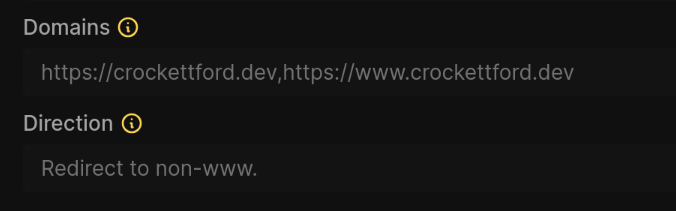
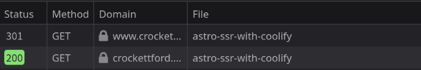

## Why worry about trailing slashes?
I recently decided to spruce up my personal website. Since building this site, I’ve learned a lot more about technical SEO and best practices. Looking back at the code with fresh eyes made me recoil in horror on several occasions.

One issue I wouldn't have anticipated before was duplicate URLs, since my site happily served URLs both with and without trailing slashes. That means that `crockettford.dev/blog/a-blog-article` was just as valid as `crockettford.dev/blog/a-blog-article/`. This is perfectly fine in terms of UX, but it means that search engines (and my web server) see these as two distinct URLs with identical content. What's more, the www. and non-www. domains were both served independently, leading to a whopping 4 duplicates for every URL.

Obviously, <a target="_blank" href="https://www.semrush.com/blog/duplicate-content/"> duplicate content isn't good</a>. I had become aware of how to avoid these issues in the time since I first set up my website, but I didn't think to go back and fix past errors until I tried integrating <a target="_blank" href="https://giscus.app/">giscus</a> into my blog for an easy, safe comment system. As the first couple comments rolled in, I got excited, and then quickly worried when I suddenly couldn't see them. 

It turned out that the giscus comment had been made on the www subdomain without a trailing slash, so none of the other three versions of the URL could display the comment. Giscus relies on a hash generated from the URL or path (depending on your config), so any variation at all mean that the post isn't recognized as the same and the comments don't load. You could only see the comment on that subdomain withoout the trailing slash. 

What's more, Google Search Console showed that a few of my posts were starting to rank, specifically [my Astro + Coolify tutorial](/blog/astro-with-coolify) and the addendum about [hosting an Astro SSR site with Coolify](/blog/astro-ssr-with-coolify). I was ecstatic that people were finding my content useful, but GSC also showed that it had identified a number of duplicate URLs with no set canonical, something I also forgot to do when I first created this site as a greenhorn. I even didn't change the default meta description, so google was just pulling the first few lines of text form the article body. Whoops!

It was time to remedy my mistakes!

## The fix
There were three main issues to solve: 
1. Redirect www to non-www URLs.
2. Redirect trailing-slash pages to non-trailing slash pages (since those were the ones Google had indexed and ranked).
3. Fix meta tags sitewide and add an XML sitemap, among other minor improvements."

### www redirects
This one is the simplest. As I mentioned, this site is hosted with Coolify, and the dashboard already has a UI option for this. Just set up an appropriate DNS record on your provider and adjust the UI setting.



Now, anyone going to the www. subdomain will get a 302 redirect to the non-www version of your site.

#### Change 302 to 301
Although we've solved the most basic problem, there's another small improvement we can make. The default redirect that Traefik issues is a [302 redirect](https://developer.mozilla.org/en-US/docs/Web/HTTP/Status/302), which indicates that content has moved *temporarily*. Obviously that's not the case for us, and we're probably better off using a 301 for the reasons described in [this SEM Rush article](https://www.semrush.com/blog/301-vs-302-redirect/).

We can get Traefik to issue a 301 instead by changing one line of the Traefik labels.

Specifically, we need to find this: 
```
traefik.http.middlewares.1-tk8cgcw-to-non-www.redirectregex.permanent=false
```
and change it to
```
traefik.http.middlewares.1-tk8cgcw-to-non-www.redirectregex.permanent=true
```
Beware that the auto-generated service/middleware name in the middle of this line will be different for your project. All we're doing is switching `permanent=false` to `permanent=true`, after which we should see the redirect we want.



Now search engines know that the content that was at www will always be found at the non-www URL.

### Redirect trailing-slash pages to non-trailing slash (or vice-versa)
I've decided to redirect to non-trailing slash URLs because that's the format of the pages that are already ranking on Google, so bringing the rest of the site in line with them seems safer than changing the only pages on my site that Google cares about.

As mentioned in the [Astro docs for the trailing slash config options](https://docs.astro.build/en/reference/configuration-reference/#trailingslash): 
>Trailing slashes on prerendered pages are handled by the hosting platform, and may not respect your chosen configuration. See your hosting platform’s documentation for more information.

Since all of my blog pages are static, I'll need to do this in the Traefik config again. 

We'll be configuring and adding some middleware for this. Here it is: 
```
# New middleware for trailing slash removal
traefik.http.middlewares.strip-trailing-slash.redirectregex.permanent=true
traefik.http.middlewares.strip-trailing-slash.redirectregex.regex=^(https?://[^/]+/.*)/+$
traefik.http.middlewares.strip-trailing-slash.redirectregex.replacement=${1}
```
Then register the middleware in addition to our default middleware: 
```
# Updated middleware chain
traefik.http.routers.https-1-tk8cgcw.middlewares=gzip,1-tk8cgcw-to-non-www,strip-trailing-slash
```

If you want to ensure that all URLs have a trailing slash, you can instead configure your middleware like this: 
```
traefik.http.middlewares.add-trailing-slash.redirectregex.permanent=true
traefik.http.middlewares.add-trailing-slash.redirectregex.regex=^(https?://[^/]+/[^/]*)$
traefik.http.middlewares.add-trailing-slash.redirectregex.replacement=${1}/
```

Now all URLs with a trailing slash will automatically redirect to their non-trailing slash variant, or vice-versa. Moving forward, I'll assume you've done the same as me and wish to strip the tailing slash from all URLs.

#### Changing Astro to support our new trailing-slash free config
Astro has built-in config support for whichever option you chose. Modify your astro.config.mjs to include the option: 
```
export default defineConfig({
  site: 'https://crockettford.dev',
  trailingSlash: 'never',
});
```
This will give you a helpful warning if you try to navigate to a page using a URL with a trailing slash during development, identifying any links you've written incorrectly. Also, it will automatically redirect on-rendered pages to their non-trailing slash variant, meaning that between this and our Traefik middleware, we are fully covered for redirects.

### Other technical SEO improvements in Astro

These other changes are well-documented elsewhere, so I'll only describe them briefly. 

#### Canonical URLs

Since we've set the site in our astro config to `site: 'https://crockettford.dev'`, we can automatically generate canonical tags for every page that match our trailing-slash free schema. Put this in the frontmatter of your layout: 

```
const canonicalUrl = new URL(Astro.url.pathname, Astro.site).toString();
```
Then add the following tag in your head tag: 
```
<link rel="canonical" href={canonicalUrl} />
```

#### Sitemap Integration

Astro has an officially supported [integration that generates a sitemap for you](https://docs.astro.build/en/guides/integrations-guide/sitemap/), which I installed. The installation and configuration instructions on the linked docs page work perfectly. Head to your sitemap URL to doublecheck that it has generated only URLs which reflect your desired trailing-slash setting. 

#### Descriptions

For meta descriptions, I decided that I would use the .md file's frontmatter. I wanted to keep my sarcastic descriptions for on-site display, but have a separate description for SEO purposes. For example, here is the frontmatter for this article: 

```
---
title: "Handle Trailing Slash Redirects for your Astro site Using Coolify and Traefik"
pubDate: 2025-02-15
description: "Don't be like me and end up with duplicate pages for every post on your blog..."
seoDescription: "A guide to setting up Traefik redirects in the Coolify dashboard and fixing technical SEO issues in your Astro blog."
author: Crockett
tags: ["self-hosting", "tutorial"]
---
```

I then pass seoDescription from my [slug].astro 
```
<BlogPostLayout frontmatter={entry.data}>
  <Content />
</BlogPostLayout>
```
to the main Layout.astro
```
<Layout title={frontmatter.title} description={frontmatter.seoDescription}>
```
which handles it in the frontmatter as a prop and passes it to the head tag
```
interface Props {
  title: string;
  description?: string;
}

const { title, description } = Astro.props;

// More stuff here

<meta name="description" content={description} />
```

## Conclusion and what about other tags?

Once all this was fixed up, I felt I had addressed the bulk of the pressing issues. Of course I could do more with additional tags, but since this is my personal site, I want to keep it minimal but functional. For a client or for my own [business website](https://dataparty.dev), I would definitely make a more elaborate tags set up, but this amount feels just right to me on my personal site. 

It's nice to know that even though my technicals were a mess, the content was valuable enough to rank highly anyway. It's also a great feeling to look at your old work and wonder what the hell you were thinking, since it means you've learned a lot in the meantime. 