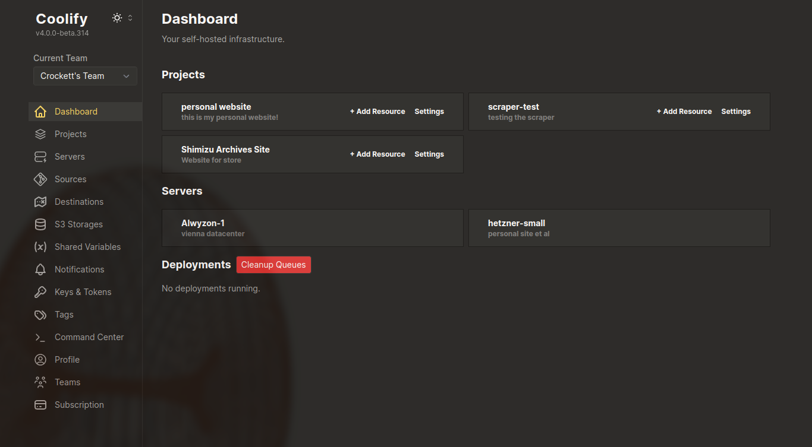
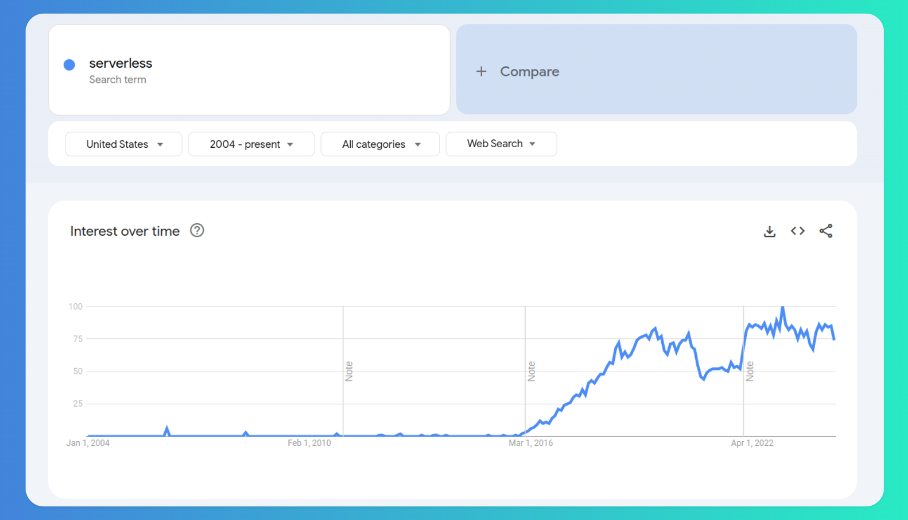

# Coolify and Self-Hosting

[Coolify](https://coolify.io/) is a free and open-source, self-hostable server manager meant to marry the flexibility and cost-effectiveness of self-hosting with the convenience of platforms like Heroku, Netlify, and Vercel. Coolify automates and abstracts away a lot of the nitty-gritty of self-hosting and gives you a sleek, user-friendly interface from which to manage your servers and projects.

Even as a self-hosting newbie it offers an approachable way to start managing your own infrastructure. I have started using it to host all my projects and I think I've used at most 20% of the features it has. The [Github repo](https://github.com/coollabsio/coolify) is actively developed and the creator, [Andras](https://github.com/andrasbacsai) is dedicated and friendly. 

As you can probably tell, I'm a big fan. While it is open-source and totally free, they offer managed cloud instances starting at $5 per month, which I chose to pay as a way to support the project.

## Why self host?
Cloud infrastructure is ubiquitous and essential to the internet. But backend-focused services Vercel and Netlify didn't come onto the scene until the mid 2010s, after which the term "serverless" started to enter the (technical) public's consciousness.

I am of the belief that "serverless" is a misnomer, since it's not that there isn't a server involved, but instead that the server is completely hands-off. That is, a company is taking care of the provisioning and scaling for you behind the scenes, and charging you accordingly. In fact, Vercel's infrastructure [relies on AWS](https://vercel.com/blog/behind-the-scenes-of-vercels-infrastructure) under the hood. Netlify is the same. Both platforms--and others like them--are selling convenience above all else. Seamless deployment, Git integration, CI/CD, and scalability do not come without a price, however.

Just like the [the cloud is just someone else's computer](https://xkcd.com/908/), [serverless is just someone else's server](https://www.cloudflare.com/learning/serverless/what-is-serverless/), and someone else's server is never free. A cursory search will pull up innumerable horror stories about runaway hosting bills from Vercel and Netlify, both with and without happy resolutions. These services are able to charge whatever they see fit to wrap yet other cloud providers. They have ultimate control over your app or website, and they can pull the plug whenever they please and for whatever reason, financial or not.

The question then is why not go straight to the source and rent from AWS or Azure? Or you can go even lower and get a VPS from Hetzner, Digital Ocean, Linode, etc. The answer for many is that you lose the convenience of automated deployments and all the other bells and whistles that come with a platform provider like Vercel. Most of all, you lose the magic word: *scalability*. So, is the tradeoff worth it? Or is there another way?

## Meet me in the middle
So, you don't want to expose yourself to some of the risks of using a provider like Vercel, but you don't want to become a professional sysadmin to do it. This is the aim of a platform like Coolify, to give you the much of the convenience and flexibility of those platforms while letting you keep all the power over your app. Between Docker and Nixpacks, virtually every language and framework is supported. Kubernetes support is on the way. Push to deploy and all manner of other CI/CD tools are automatically configured or easy to set up. Database backups, webhooks, an API, automatic SSL certificates, reverse proxy setup, and on and on. And ***it's free***. The only thing you pay for is the hardware to host it on.

I know I'm coming off as an evangelist, and maybe I am, but I think this is really what those interested in an open internet should be focusing their attention on. Convenience and automation are *good*, at least in and of themselves. They should not be avoided. The solution to the [entshittification](https://en.wikipedia.org/wiki/Enshittification) of the web is not to return to the past. Telling everyone that doesn't like it to DIY everything themselves from the ground up ignores the reason these platforms and providers rose to prominence in the first place. Instead, we can take the tools at hand and make them free and open for everyone. The need for accessibility and convenience is what drove people to those platforms, and the hassle and costs will drive many away, provided there is a suitable alternative.

Tools like Coolify make me excited because they have all the great things about open source without suffering many of the pitfalls that open-source projects can exhibit, like reluctance to appeal to the mainstream and failure to put a premium on ease of use. Many open source projects are created, used, and maintained by very tech-savvy people who often simply don't see the need to make their project more accessible. 

Any entrepreneur is likely looking to cut fat from the development process wherever possible, and manually configuration is an obvious time sink. The people who started these deployment platforms saw that, and they've become rich off that insight. So, in my estimation, any legitimate FOSS effort in that space needs to keep that in mind. That's what Coolify does. 

### A brief aside about 'scalability'
Now what I'm about to say may be incorrect and ill-informed, but I think it's worth raising. One of the key advantages deployment platforms have is that the automatically provision extra resources for you app or site whenever you need them. This major strength is exactly what can lead to unexpected, massive bills if the user isn't careful. But is being scalability really something that I--a single developer building small apps and sites--and others like me need to worry about. Too many people want to use my app and it breaks down for an hour or so until I can provision more resources? That sounds like a good problem to have, actually. 

I think the principle to keep in mind here is [YAGNI](https://en.wikipedia.org/wiki/You_aren't_gonna_need_it) - *you aren't gonna need it*. Or, in a more verbose expression from John Carmack also quoted in the Wikipedia article, ["It Is hard for less experienced developers to appreciate how rarely architecting for future requirements/applications turns out net-positive"](https://x.com/ID_AA_Carmack/status/1405932642005041153). 

Until I'm proven wrong, I'm going to keep assuming that the minimum viable resources for my app or site are always the best. I'll worry about scaling when I need to and not before.

## Hope for the future
I feel passionate about this topic. I'm definitely not an expert, more like a passionate advanced beginner who is just starting to appreciate all the things that are possible. What I do know is that I still think the internet has the potential to become something closer to what its early adopters dreamed of. I think many are tiring of centralization. I am. Maybe this is a kind of internet rugged individualism, the fantasy of carving out your own place without falling prey to every would-be middleman along the way. I don't think I'm clever enough to figure out the import of this desire or the ubiquity of the vibe shift, but, personally, I can feel a change coming and it's feeling pretty good.